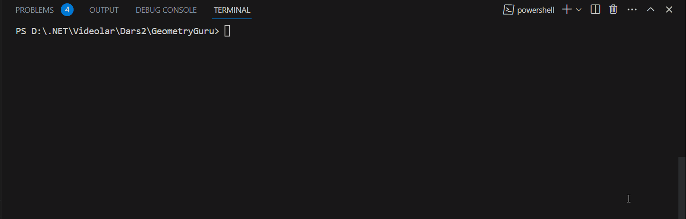

# GeometryGuru v1.0
This program finds the area of a geometric figure

Have a look at `Program.cs` file and you can see how I have used:

* Console input/output
* Arithmetic operations to find the area of triangle

## Demo

## How to run locally
1. Press the green clone button and copy the git **[link](https://github.com/Jarus95/GeometryGuru.git)**

2. Open your local folder and run terminal then enter the command *git clone **[link](https://github.com/Jarus95/GeometryGuru.git)***

3. Open project and write _dotnet run_ command in terminal
